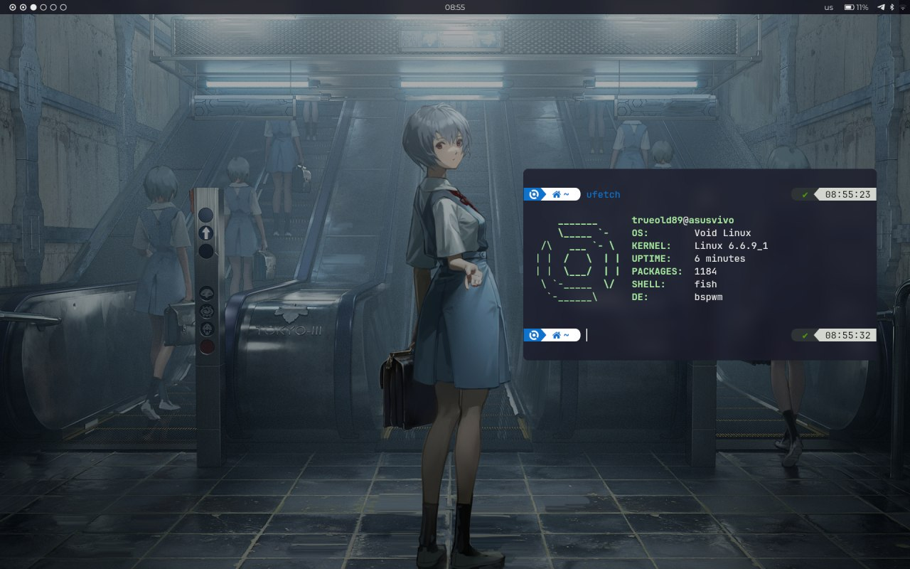

# YET ANOTHER BSPWM RICE (REI CATPPUCCIN)

## 🖼️ Screenshots:

## 📦 Packages:

- **🪟 BSPWM**
- **⌨️  SXHKD**
- **📜 Rofi**
- **📅 Polybar**
- **🗔  Kitty**
- **🐠 Fish**
- **✨ Picom**
- **💬 Dunst**
- **🗔  Tmux**

---

#### 🎨  GTK Theme: [Catppuccin-Mocha-Sapphire](https://github.com/catppuccin/gtk.git)

#### 📁  Icon Theme: [Colloid-Icon-Theme Dracula](https://github.com/vinceliuice/Colloid-icon-theme)

#### 🗔   Tmux Theme: [Catppuccin Latte](https://github.com/catppuccin/tmux)

---

## 💚 Sources:

#### Rofi config based on: [adi1090x/rofi](https://github.com/adi1090x/rofi)

#### Polybar modules from: [adi1090x/polybar-themes](https://github.com/adi1090x/polybar-themes) 

## 🗒️ Useful Info:

#### For all picom features you need: [kiosion/picom fork](https://github.com/kiosion/picom)

#### Fot tmux plugins you need: [TPM](https://github.com/tmux-plugins/tpm)

#### Tmux plugins:
 - [tmux-sensible](https://github.com/tmux-plugins/tmux-sensible)

## 🔗 Other Links:

#### [ORUDO Gitea Repo (My selfhosted Gitea)](https://git.orudo.ru/trueold89/yabr)

#### [GitHub Repo](https://github.com/Trueold89/yabr)

#### [GitLab Repo](https://gitlab.com/Trueold89/yabr)

## ⬆️  Help me on Reddit:

#### [r/unixporn](https://www.reddit.com/r/unixporn/comments/15lfuwf/yet_another_rice_with_some_smooth_animations_bspwm/?utm_source=share&utm_medium=web2x&context=3)

#### [r/bspwm](https://www.reddit.com/r/bspwm/comments/15lfxsb/yet_another_rice_with_some_smooth_animation/?utm_source=share&utm_medium=web2x&context=3)
